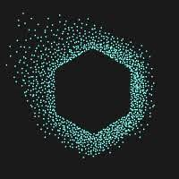
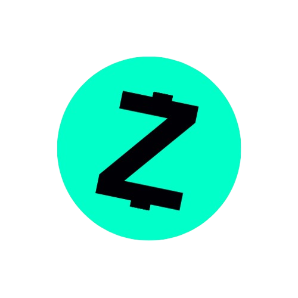

  
   
  

## :technologist: About me 

:cowboy_hat_face: Hi, i’m Jorge Lucas 

:older_man: Age: 26

:restroom: Pronouns: He/Him

:computer: I'm a software development student and backend developer!

🏡 From Rio de Janeiro, now living in Fortaleza, Brazil.

:zap: Fun fact: I'm a flag football player :football:.

<!-- iRede (2024) -->
<table style="border-collapse: collapse; border: none; margin-bottom: 20px;">
  <tr>
    <td width="100" align="center" style="border: none;">
      
    </td>
    <td style="border: none; padding-left: 16px;">
      <strong>Backend Developer</strong> 
      <a href="https://irede.org.br/#/home"><strong>iRede</strong></a> 
      Languages & Tools: <code>Python</code>, <code>FastAPI</code>, <code>Java</code>, <code>Spring</code>, <code>GoLang</code>. 
      Dates: <em>Jun 2024 – Dec 2024</em>
    </td>
  </tr>
</table>

<!-- Centz -->
<table style="border-collapse: collapse; border: none; margin-bottom: 20px;">
  <tr>
    <td width="100" align="center" style="background-color: white; border-radius: 8px; border: none;">
      
    </td>
    <td style="border: none; padding-left: 16px;">
      <strong>Backend Developer</strong> 
      <a href="https://centz.com.br/"><strong>Centz</strong></a> 
      Languages & Tools: <code>Python</code>, <code>FastAPI</code>, <code>Javascript</code>, <code>Node.js</code>, <code>PostgreSQL</code>. 
      Dates: <em>Jan 2024 – Aug 2025</em>
    </td>
  </tr>
</table>

<!-- iRede (2025) -->
<table style="border-collapse: collapse; border: none; margin-bottom: 20px;">
  <tr>
    <td width="100" align="center" style="border: none;">
      
    </td>
    <td style="border: none; padding-left: 16px;">
      <strong>Backend Developer</strong> 
      <a href="https://irede.org.br/#/home"><strong>iRede</strong></a> 
      Languages & Tools: <code>Python</code>, <code>FastAPI</code>, <code>Java</code>, <code>Spring</code>, <code>GoLang</code>, <code>PostgreSQL</code>, <code>MongoDB</code>, <code>Neo4j</code>. 
      Dates: <em>Jun 2025 – Aug 2025</em>
    </td>
  </tr>
</table>

<!-- ESP/CE -->
<table style="border-collapse: collapse; border: none; margin-bottom: 20px;">
  <tr>
    <td width="100" align="center" style="background-color: white; border-radius: 8px; border: none;">
      
    </td>
    <td style="border: none; padding-left: 16px;">
      <strong>Backend Developer</strong> 
      <a href="https://www.esp.ce.gov.br/#/home"><strong>Escola de Saúde Pública (ESP/CE)</strong></a> 
      Languages & Tools: <code>PHP</code>, <code>Laravel</code>, <code>Python</code>, <code>FastAPI</code>, <code>PostgreSQL</code>. 
      Dates: <em>Sep 2025 – Present</em>
    </td>
  </tr>
</table>

## :dart: Skills

### Programming languages :tongue:

  

### Frameworks :gear:

  

### Tools :hammer_and_wrench:

  

### Databases :card_index_dividers:

  

## :mailbox: How to reach me

  

  

  

