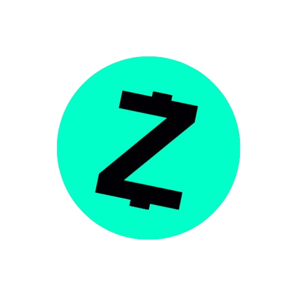

  
   
  

## :technologist: About me 

:cowboy_hat_face: Hi, i’m Jorge Lucas 

:older_man:  Age: 25

:restroom: Pronouns: He/Him

:computer: I'm a software development student and backend developer!

:house_with_garden: I’m from Fortaleza - Brazil.

:zap: Fun fact: I'm a flag football player :football:.

## :briefcase: Experiência de trabalho

**Desenvolvedor Backend** \
[**iRede**](https://irede.org.br/#/home) • Bolsista \
Linguagens & Tecnologias: `Python`, `FastAPI`, `Java`, `Spring` e `GoLang`.\
Período: `jun/2024` - `dez/2024`
 

**Desenvolvedor Backend** \
[**Centz**](https://centz.com.br/) • Estágio \
Linguagens & Tecnologias: `Python`, `FastAPI`, `Javascript`, `Node.js` e `PostgreSQL`.\
Período: `jan/2024` - `atual`

 

**Desenvolvedor Backend** \
[**iRede**](https://irede.org.br/#/home) • Bolsista \
Linguagens & Tecnologias: `Python`, `FastAPI`, `Java`, `Spring`, `GoLang`, `PostgreSQL`, `MongoDB` e `Neo4j`.\
Período: `jun/2025` - `atual`
 

## :dart: Skills

### Programming languages :tongue:

### Tools :hammer_and_wrench:

### Databases :card_index_dividers:

## :mailbox: How to reach me

 

