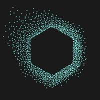
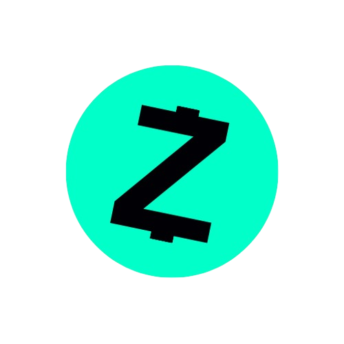

# :technologist: About me 

:cowboy_hat_face: Hi, i'm Jorge Lucas — tech nerd at heart, always curious, always tinkering with something new

:older_man: Age: 26

:restroom: Pronouns: He/Him

:computer: I'm a backend developer!

:house_with_garden: From Rio de Janeiro, now living in Fortaleza, Brazil

:muscle: When I'm not at the keyboard, you'll find me on the field or the court — I play flag football :football: and volleyball :volleyball:

:keyboard: I use Neovim btw :moyai:

# :briefcase: Experience 

<table width="100%" style="border-collapse: collapse; border: none;">
  <colgroup>
    <col width="100">
    <col>
  </colgroup>
  <tr height="130">
    <td width="100" align="center" valign="middle" style="background-color: white; border-radius: 8px; border: none; padding: 8px;">
      
    </td>
    <td valign="middle" style="border: none; padding-left: 16px;">
      <strong>Backend Developer</strong> · <a href="https://www.esp.ce.gov.br/#/home"><strong>Escola de Saúde Pública (ESP/CE)</strong></a>
      (Sep 2025 – Present)  
      
      
      
       
      
      
       
    </td>
  </tr>
  <tr height="130">
    <td width="100" align="center" valign="middle" style="background-color: white; border-radius: 8px; border: none; padding: 8px;">
      
    </td>
    <td valign="middle" style="border: none; padding-left: 16px;">
      <strong>Backend Developer</strong> · <a href="https://irede.org.br/#/home"><strong>iRede</strong></a>
      (Jun 2025 – Aug 2025)  
      
      
      
      
       
      
      
      
       
    </td>
  </tr>
  <tr height="130">
    <td width="100" align="center" valign="middle" style="background-color: white; border-radius: 8px; border: none; padding: 8px;">
      
    </td>
    <td valign="middle" style="border: none; padding-left: 16px;">
      <strong>Backend Developer</strong> · <a href="https://centz.com.br/"><strong>Centz</strong></a>
      (Jan 2024 – Aug 2025)  
      
      
      
       
      
      
       
    </td>
  </tr>
    <tr height="130">
    <td width="100" align="center" valign="middle" style="background-color: white; border-radius: 8px; border: none; padding: 8px;">
      
    </td>
    <td valign="middle" style="border: none; padding-left: 16px;">
      <strong>Backend Developer</strong> · <a href="https://irede.org.br/#/home"><strong>iRede</strong></a>
      (Jun 2024 – Dec 2024)  
      
      
      
       
      
      
      
       
    </td>
  </tr>
</table>

# :dart: Skills

### Programming languages :tongue:

  

### Frameworks :gear:

  

### Tools :hammer_and_wrench:

  

(I use Arch btw)

### Databases :card_index_dividers:

  

### DevOps :recycle:

  

# :mailbox: How to reach me

  

  

  

